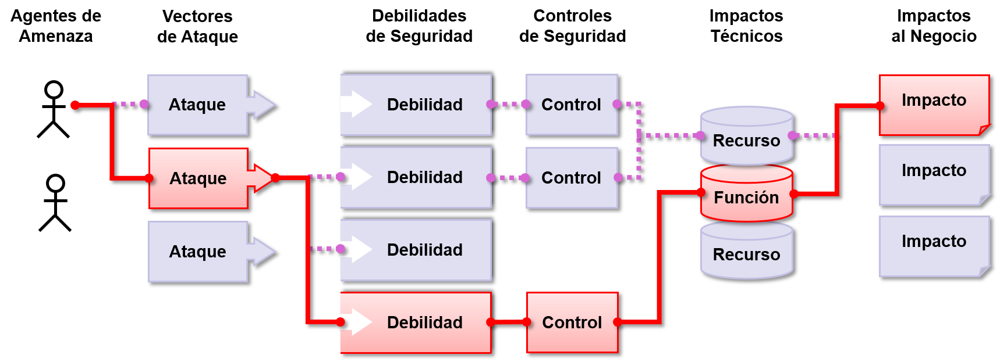

# Riesgo - Riesgos en Seguridad de Aplicaciones

## ¿Qué son los riesgos en seguridad de aplicaciones?

Los atacantes potencialmente pueden utilizar distintas rutas a través de su aplicación para perjudicar a su negocio u organización. Cada uno de estos caminos representa un riesgo que puede o no ser suficientemente grave como para merecer atención. 

A veces, estos caminos son triviales de encontrar y explotar, mientras que otras son extremadamente difíciles. De la misma manera, el perjuicio ocasionado puede no tener consecuencias, o puede dejarlo en la quiebra. A fin de determinar el riesgo para su organización, puede evaluar la probabilidad asociada a cada agente de amenaza, vector de ataque, debilidad de seguridad y combinarlo con una estimación del impacto técnico y de negocio para su organización. Juntos, estos factores determinan su riesgo general.

## ¿Cuál es Mi Riesgo?

El [OWASP Top 10](https://owasp.org/www-project-top-ten/) se enfoca en identificar los riesgos más críticos para un amplio espectro de organizaciones. Para cada uno de éstos riesgos, se proporciona información genérica sobre la probabilidad y el impacto técnico utilizando el siguiente esquema de evaluación, basado en la Metodología de Evaluación de Riesgos de OWASP.

| Agente de Amenaza | Explotabilidad | Prevalencia de Vulnerabilidad | Detección de Vulnerabilidad | Impacto Técnico | Impacto de Negocio |
| -- | -- | -- | -- | -- | -- |
| Específico | Fácil 3    | Difundido 3  | Fácil 3    | Severo   3 | Específico |
| de la 	 | Promedio 2 | Común 2      | Promedio 2 | Moderado 2 | del        |
| Aplicación | Difícil 1  | Poco Común 1 | Difícil 1  | Mínimo   1 | Negocio    |

En ésta edición, hemos modificado el sistema de clasificación de riesgo en comparación con la versión anterior, para asistir nuestra evaluación de probabilidades e impactos. Este no es un tema del documento, pero está claro en el análisis de los datos públicos.

Cada organización es única, y también lo son los actores de la amenaza para esa organización, sus objetivos y el impacto de cualquier brecha. Si una organización de interés público utiliza un CMS para información pública y el sistema de salud utiliza el mismo CMS para datos sensibles, los agentes de amenaza y los impactos en el negocio son muy distintos para el mismo software. Es fundamental que conozca sus propios sus agentes de amenazas y los impactos al negocio basados en la criticidad de los activos de datos.

En la medida de lo posible, los nombres de los riesgos en el Top 10 están alineados con las debilidades del CWE para promover prácticas de seguridad generalmente aceptadas y reducir la confusión.

## Referencias

### OWASP

- [Metodología de evaluación de riesgos de OWASP](https://owasp.org/www-community/OWASP_Risk_Rating_Methodology)
- [Artículo sobre modelado de amenaza/riesgo](https://owasp.org/www-community/Threat_Modeling)

### Externas

- [ISO 31000: Risk Management Std](https://www.iso.org/iso-31000-risk-management.html)
- [ISO 27001: ISMS](https://www.iso.org/isoiec-27001-information-security.html)
- [NIST Cyber Framework (US)](https://www.nist.gov/cyberframework)
- [ASD Strategic Mitigations (AU)](https://www.cyber.gov.au/acsc/view-all-content/publications/strategies-mitigate-cyber-security-incidents)
- [NIST CVSS 3.0](https://nvd.nist.gov/vuln-metrics/cvss/v3-calculator)
- [Herramienta de modelado de riesgos de Microsoft](https://www.microsoft.com/en-us/download/details.aspx?id=49168)
