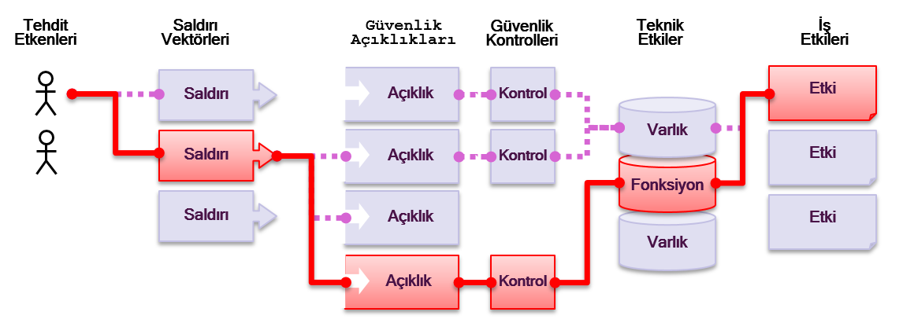

# Risk - Uygulama Güvenliği Riskleri

## Uygulama Güvenliği Riskleri Nelerdir?

Saldırganlar işinize veya kurumunuza zarar vermek için uygulamanız üzerinden farklı yollar deneyebilirler. Bu farklı yolların her biri dikkat etmeyi gerektirecek kadar ciddi olabilecek veya olamayacak bir risk oluşturmaktadır.

Bazen bu yolların bulunması ve istismar edilmesi kolay olurken, bazen de son derece zor olabilmektedir. Benzer bir şekilde, oluşacak zarar da hiçbir öneme sahip olamayacağı gibi işinizi tehlikeye atabilecek boyutta da olabilmektedir. Kurumunuz için riskleri belirlerken, her bir tehdit etkeni ile ilişkilendirilen olasılığı, saldırı vektörünü ve güvenlik açığını değerlendirebilir ve bunu kurumunuzun üzerinde bırakmasını beklediğiniz teknik ve iş etkileri ile birleştirebilirsiniz. 

## Risklerim Neler

[OWASP İlk 10](https://www.owasp.org/index.php/Top10) farklı kurumlar için en ciddi web uygulaması güvenlik risklerini belirlemeye çalışmaktadır. Bu risklerin her biri için, OWASP Risk Belirleme Metadolojisi'ne dayanan aşağıdaki basit derecelendirme şemasını kullanarak olasılığı ve teknik etkisi hakkında genel bilgi sağlamaktayız.

| Tehdit Etkenleri | İstismar Edilebilirlik | Zafiyetin Yaygınlığı | Tespit Edilebilirlik | Teknik Etkiler | İş Etkileri |
| -- | -- | -- | -- | -- | -- |
| Uygu-   | Kolay 3 | Çok yaygın 3 | Kolay 3 | Ciddi 3 | İş     |
| lama   | Orta 2 | Yaygın 2 | Orta 2 | Orta 2 | Özel |
| özelinde | Zor 1 | Nadir 1 | Zor 1 | Önemsiz 1 |       |

Bu sürümde, riskler için etki ve olasılık hesaplamasında yardımcı olması adına risk derecelendirme sistemini güncelledik. Daha fazla detay için, lütfen [Riskler Hakkında Notlar](0xc0-note-about-risks.md) kısmına bakınız.

Her kurum birbirinden farklıdır ve bunun sonucu olarak kurum için mevcut tehdit etkenleri, bunların amaçları ve herhangi bir ihlal durumunda etkileri de farklıdır. Kamu yararına hitap eden bir kurum ile hassas sağlık kayıtları içeren bir sağlık sistemi aynı içerik yönetim sistemini (CMS) kullansa bile, tehdit etkenleri ve iş etkileri aynı yazılım için birbirinden son derece farklı olacaktır. Bu yüzden, kurumunuz için var olan riskleri, uygulanabilir tehdit etkenlerini ve iş etkilerini göz önünde bulundurarak anlamanız büyük önem taşımaktadır.

Mümkün olabildiğince, İlk 10 içerisinde yer alan riskler, karmaşıklığı azaltmak ve genel olarak kabul görmüş adlandırma kurallarını teşvik etmek için [Common Weakness Enumeration](https://cwe.mitre.org/) (CWE) içerisinde yer alan açıklıklar ile benzer şekilde isimlendirilmiştir.

## Kaynaklar

### OWASP

* [OWASP Risk Derecelendirme Metadolojisi](https://www.owasp.org/index.php/OWASP_Risk_Rating_Methodology)
* [Tehdit/Risk Modelleme hakkında bir makale](https://www.owasp.org/index.php/Threat_Risk_Modeling)

### Dış Kaynaklar

* [ISO 31000: Risk Yönetimi Standardı](https://www.iso.org/iso-31000-risk-management.html)
* [ISO 27001: ISMS](https://www.iso.org/isoiec-27001-information-security.html)
* [NIST Cyber Framework (US)](https://www.nist.gov/cyberframework)
* [ASD Strategic Mitigations (AU)](https://www.asd.gov.au/infosec/mitigationstrategies.htm)
* [NIST CVSS 3.0](https://nvd.nist.gov/vuln-metrics/cvss/v3-calculator)
* [Microsoft Tehdit Modelleme Aracı](https://www.microsoft.com/en-us/download/details.aspx?id=49168)
