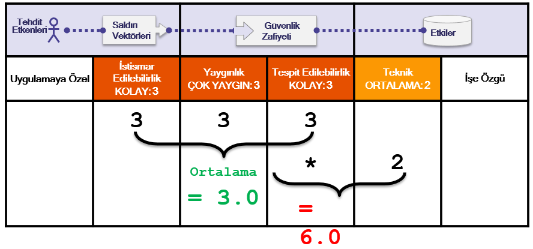

# +R Riskler Hakkında Not

## Zayıflıkların Temsil Ettiği Riskler Hakkında

İlk 10 için Risk Derecelendirme metadolojisi  [OWASP Risk Derecelendirme Metadolojisi'ne](https://owasp.org/www-community/OWASP_Risk_Rating_Methodology) dayanmaktadır. İlk 10'da yer alan her bir kategori için, her bir ortak zayıflık için olasılık faktörlerine ve etki faktörlerine bakarak tipik bir web uygulamasında her bir zayıflığın oluşturacağı tipik riski tahmin ettik. Bir uygulamaya en önemli riski teşkil eden bu zayıflıklara göre sonrasında İlk 10 listesini tekrar sıraladık. Bu faktörler, her bir yeni İlk 10 sürümü ile bir şeyler değiştiğinde güncellenmektedir.

[OWASP Risk Derecelendirme Metadolojisi](https://owasp.org/www-community/OWASP_Risk_Rating_Methodology) belirlenmiş bir açıklık için risk hesaplamasında yardımcı olmak için çok sayıda faktör tanımlamaktadır. Fakat, İlk 10 gerçek uygulama ve API'lerdeki belirli açıklıklardan ziyade genellenebilir açıklıklardan bahsetmelidir. Sonuç olarak, uygulamalar için risk hesaplanırken, hiçbir zaman uygulama sahipleri veya yöneticileri kadar net olamayacağız. Uygulamalarınızın ve verinizin önemi, tehditlerinizin ne olduğu ve sisteminizin nasıl geliştirildiği ve işletildiği konusunda hüküm vermek için en iyi donanıma sahip olan sizlersiniz.

Metadolojimiz her bir zayıflık için üç olasılık faktörü (yaygınlık, tespit edilebilirlik ve istismarın kolaylığı) ve bir etki faktörü (teknik etki) içermektedir. Her bir faktöre özgü terminoloji ile risk her bir faktör için 1-Düşük ile 3-Yüksek arasında derecelenmektedir. Bir zayıflığın yaygınlığı, genellikle hesaplamak zorunda olmadığınız bir faktördür. Yaygınlık verisi için, (25. sayfadaki Teşekkürler kısmında bahsedildiği gibi) birtakım farklı kurumlardan yaygınlık istatistiği aldık ve yaygınlık açısından bir İlk 10 varoluş olasılığı listesi oluşturmak için bu verileri birleştirdik. Her bir zayıflık için bir olasılık oranı yapmak için daha sonra bu veriler dğer iki olasılık faktörü (tespit edilebilirlik ve istismarın kolaylığı) ile birleştirildi. Olasılık oranı, İlk 10 listesindeki her bir eleman için genel bir risk derecelendirmesi oluşturmak için her bir eleman için tahmin edilen ortalama teknik etki ile çarpılmıştır (sonuç yükseldikçe risk de artmaktadır). Tespit Edilebilirlik, İstismarın Kolaylığı ve Etki her bir İlk 10 kategorisi ile ilişkilendirilen ve raporlanan CVE'ler analiz edilerek hesaplanmıştır. 

**Not**: Bu yaklaşım tehdit etkeni olasılığını hesaba katmamaktadır. Ayrıca belirli bir uygulamanız ile ilişkilendirilen çeşitli teknik detayların herhangi birisini de hesaba katmamaktadır. Bu faktörlerden herhangi birisi, saldırganın özel bir açıklığı bulması ve istismar etmesi olasılığını önemli derecede etkileyebilmektedir. Bu derecelendirme işiniz üzerindeki asıl etkiyi hesaba katmamaktadır. Kültürünüz, endüstri alanınız ve düzenleyici çevreniz düşünülerek, kurumunuz uygulama ve API'leri için kabul etmeye hazır olduğu güvenlik riski düzeyini belirlemek zorundadır. OWASP İlk 10 listesinin amacı sizin adınıza bu risk analizini yapmak değildir.

Aşağıdaki tablo **A6:2017-Yanlış Güvenlik Yapılandırması** için risk hesaplamamızı göstermektedir.

