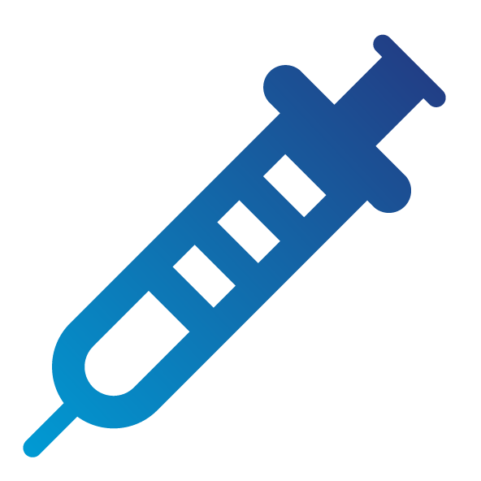

# A03:2021 – Injeksi    {: style="height:80px;width:80px" align="right"} 

## Faktor-Faktor

| CWE Dipetakan | Tingkat Kejadian Maksimum | Rata-rata Tingkat Kejadian | Rata-rata Exploitasi Terbobot | Rata-rata Dampak Terbobot | Cakupan Maksimum | Rata-rata Cakupan | Total Kejadian| Total CVEs |
|:-------------:|:--------------------:|:--------------------:|:--------------:|:--------------:|:----------------------:|:---------------------:|:-------------------:|:------------:|
| 33          | 19,09%             | 3,37%              | 7,25                 | 7,15                | 94,04%       | 47,90%       | 274.228           | 32.078     |

## Ringkasan

Injeksi meluncur turun ke posisi tiga. 94% dari aplikasi-aplikasi yang 
dites oleh beberapa bentuk dari injeksi dengan tingkat kejadian maksimum 19%,
rata-rata tingkat kejadian 3%, dan total kejadian 274 ribu. CWE yang menonjol meliputi:
*CWE-79: Cross-site Scripting*, *CWE-89: SQL Injection*, dan *CWE-73:
External Control of File Name or Path*.

## Deskripsi

Sebuah aplikasi rentan untuk diserang ketika:

-   Pengguna memasukkan data yang tidak divalidasi, disaring, atau disanitasi
    oleh aplikasi.

-   Kueri secara dinamis atau pemanggilan yang tidak diparameterkan tanpa 
    escape peka konteks dipakai secara langsung pada interpreter.

-   Data jahat digunakan di dalam parameter pencarian object-relational mapping
    (ORM) untuk mengekstraksi rekaman sensitif tambahan.

-   Data jahat langsung digunakan atau digabungkan. SQL atau perintah 
    mengandung struktur dan data jahat dalam kueri dinamis, perintah, atau 
    stored procedure.

Beberapa injeksi yang biasa terjadi adalah SQL, NoSQL, perintah OS, pemetaan 
relasi objek (ORM), LDAP, dan bahasa ekspresi (EL), atau injeksi Object
Graph Navigation Library (OGNL). Konsepnya identik di antara semua interpreter. 
Peninjauan kode sumber adalah metode terbaik dalam mendeteksi apakah aplikasi 
tersebut rentan injeksi. Testing otomatis terhadap semua parameter, header, 
URL, cookies, JSON, SOAP, and masukan data XML sangat disarankan. 
Organisasi dapat menyertakan alat uji keamanan aplikasi statik (SAST), dinamis 
(DAST), dan interaktif (IAST) ke dalam CI/CD pipeline untuk mengidentifikasi
cacat injeksi yang ditambahkan sebelum penggelaran produksi.

## Bagaimana Mencegah

Pencegahan injeksi membutuhkan pemisahan data dari perintah dan kueri:

-   Pilihan yang disukai adalah menggunakan API yang aman, yang mencegah 
    penggunaan interpreter secara keseluruhan, menyediakan sebuah antar muka 
    terparameterisasi, atau migrasi ke Object Relational Mapping Tools (ORMs).<br/>
    **Catatan:** Bahkan ketika diparameterkan, stored procedure masih dapat 
    memperkenalkan injeksi SQL jika PL/SQL atau T-SQL menggabungkan kueri dan 
    data atau mengeksekusi data jahat dengan EXECUTE IMMEDIATE atau exec().

-   Menggunakan validasi masukan positif di sisi server. Ini bukan pertahanan 
    komplit karena banyak aplikasi membutuhkan karakter spesial, seperti area 
    teks atau API untuk aplikasi mobile.

-   Untuk sisa apapun dari kueri dinamis, escape-kan karakter khusus
    menggunakan sintaks escape spesifik untuk interpreter tersebut.<br/>
    **Catatan:** Struktur SQL seperti nama tabel, nama kolom, dan lain 
    sebagainya tidak bisa di-escape, sehingga nama struktur yang diberikan 
    pengguna itu berbahaya. Ini adalah masalah umum dalam perangkat lunak
    penyusun laporan.

-   Gunakan LIMIT dan kontrol SQL lainnya di dalam kueri untuk mencegah 
    penyingkapan rekaman data secara masal dalam kasus injeksi SQL.

## Contoh Skenario Serangan

**Skenario #1:** Sebuah aplikasi menggunakan data yang tidak terpercaya dalam 
konstruksi dari panggilan SQL yang rawan berikut ini:
```
String query = "SELECT \* FROM accounts WHERE custID='" + request.getParameter("id") + "'";
```
**Skenario #2:** Serupa itu, sebuah aplikasi dengan kepercayaan buta ke 
framework akan menghasilkan kueri yang masih rawan, (contoh, Hibernate Query 
Language (HQL)):
```
 Query HQLQuery = session.createQuery("FROM accounts WHERE custID='" + request.getParameter("id") + "'");
```

Pada kedua kasus, penyerang akan memodifikasi nilai parameter ‘id’ pada 
peramban web untuk mengirim: ‘ or ‘1’=’1. Sebagai contoh:
```
http://example.com/app/accountView?id=' or '1'='1
```
Ini akan mengubah arti dari kedua kueri untuk mengembalikan semua rekaman 
data dari akun tabel. Serangan yang lebih berbahaya dapat mengubah atau 
menghapus data atau bahkan memanggil stored procedure.

## Referensi

-   [OWASP Proactive Controls: Secure Database
    Access](https://owasp.org/www-project-proactive-controls/v3/en/c3-secure-database)

-   [OWASP ASVS: V5 Input Validation and
    Encoding](https://owasp.org/www-project-application-security-verification-standard)

-   [OWASP Testing Guide: SQL
    Injection,](https://owasp.org/www-project-web-security-testing-guide/latest/4-Web_Application_Security_Testing/07-Input_Validation_Testing/05-Testing_for_SQL_Injection) [Command
    Injection](https://owasp.org/www-project-web-security-testing-guide/latest/4-Web_Application_Security_Testing/07-Input_Validation_Testing/12-Testing_for_Command_Injection),
    and [ORM
    Injection](https://owasp.org/www-project-web-security-testing-guide/latest/4-Web_Application_Security_Testing/07-Input_Validation_Testing/05.7-Testing_for_ORM_Injection)

-   [OWASP Cheat Sheet: Injection
    Prevention](https://cheatsheetseries.owasp.org/cheatsheets/Injection_Prevention_Cheat_Sheet.html)

-   [OWASP Cheat Sheet: SQL Injection
    Prevention](https://cheatsheetseries.owasp.org/cheatsheets/SQL_Injection_Prevention_Cheat_Sheet.html)

-   [OWASP Cheat Sheet: Injection Prevention in
    Java](https://cheatsheetseries.owasp.org/cheatsheets/Injection_Prevention_Cheat_Sheet_in_Java.html)

-   [OWASP Cheat Sheet: Query
    Parameterization](https://cheatsheetseries.owasp.org/cheatsheets/Query_Parameterization_Cheat_Sheet.html)

-   [OWASP Automated Threats to Web Applications –
    OAT-014](https://owasp.org/www-project-automated-threats-to-web-applications/)

-   [PortSwigger: Server-side template
    injection](https://portswigger.net/kb/issues/00101080_serversidetemplateinjection)

## Daftar Klasifikasi CWE

[CWE-20 Improper Input Validation](https://cwe.mitre.org/data/definitions/20.html)

[CWE-74 Improper Neutralization of Special Elements in Output Used by a
Downstream Component ('Injection')](https://cwe.mitre.org/data/definitions/74.html)

[CWE-75 Failure to Sanitize Special Elements into a Different Plane
(Special Element Injection)](https://cwe.mitre.org/data/definitions/75.html)

[CWE-77 Improper Neutralization of Special Elements used in a Command
('Command Injection')](https://cwe.mitre.org/data/definitions/77.html)

[CWE-78 Improper Neutralization of Special Elements used in an OS Command
('OS Command Injection')](https://cwe.mitre.org/data/definitions/78.html)

[CWE-79 Improper Neutralization of Input During Web Page Generation
('Cross-site Scripting')](https://cwe.mitre.org/data/definitions/79.html)

[CWE-80 Improper Neutralization of Script-Related HTML Tags in a Web Page
(Basic XSS)](https://cwe.mitre.org/data/definitions/80.html)

[CWE-83 Improper Neutralization of Script in Attributes in a Web Page](https://cwe.mitre.org/data/definitions/83.html)

[CWE-87 Improper Neutralization of Alternate XSS Syntax](https://cwe.mitre.org/data/definitions/87.html)

[CWE-88 Improper Neutralization of Argument Delimiters in a Command ('Argument Injection')](https://cwe.mitre.org/data/definitions/88.html)

[CWE-89 Improper Neutralization of Special Elements used in an SQL Command ('SQL Injection')](https://cwe.mitre.org/data/definitions/89.html)

[CWE-90 Improper Neutralization of Special Elements used in an LDAP Query ('LDAP Injection')](https://cwe.mitre.org/data/definitions/90.html)

[CWE-91 XML Injection (aka Blind XPath Injection)](https://cwe.mitre.org/data/definitions/91.html)

[CWE-93 Improper Neutralization of CRLF Sequences ('CRLF Injection')](https://cwe.mitre.org/data/definitions/93.html)

[CWE-94 Improper Control of Generation of Code ('Code Injection')](https://cwe.mitre.org/data/definitions/94.html)

[CWE-95 Improper Neutralization of Directives in Dynamically Evaluated Code ('Eval Injection')](https://cwe.mitre.org/data/definitions/95.html)

[CWE-96 Improper Neutralization of Directives in Statically Saved Code ('Static Code Injection')](https://cwe.mitre.org/data/definitions/96.html)

[CWE-97 Improper Neutralization of Server-Side Includes (SSI) Within a Web Page](https://cwe.mitre.org/data/definitions/97.html)

[CWE-98 Improper Control of Filename for Include/Require Statement in PHP Program ('PHP Remote File Inclusion')](https://cwe.mitre.org/data/definitions/98.html)

[CWE-99 Improper Control of Resource Identifiers ('Resource Injection')](https://cwe.mitre.org/data/definitions/99.html)

[CWE-100 Deprecated: Was catch-all for input validation issues](https://cwe.mitre.org/data/definitions/100.html)

[CWE-113 Improper Neutralization of CRLF Sequences in HTTP Headers ('HTTP Response Splitting')](https://cwe.mitre.org/data/definitions/113.html)

[CWE-116 Improper Encoding or Escaping of Output](https://cwe.mitre.org/data/definitions/116.html)

[CWE-138 Improper Neutralization of Special Elements](https://cwe.mitre.org/data/definitions/138.html)

[CWE-184 Incomplete List of Disallowed Inputs](https://cwe.mitre.org/data/definitions/184.html)

[CWE-470 Use of Externally-Controlled Input to Select Classes or Code ('Unsafe Reflection')](https://cwe.mitre.org/data/definitions/470.html)

[CWE-471 Modification of Assumed-Immutable Data (MAID)](https://cwe.mitre.org/data/definitions/471.html)

[CWE-564 SQL Injection: Hibernate](https://cwe.mitre.org/data/definitions/564.html)

[CWE-610 Externally Controlled Reference to a Resource in Another Sphere](https://cwe.mitre.org/data/definitions/610.html)

[CWE-643 Improper Neutralization of Data within XPath Expressions ('XPath Injection')](https://cwe.mitre.org/data/definitions/643.html)

[CWE-644 Improper Neutralization of HTTP Headers for Scripting Syntax](https://cwe.mitre.org/data/definitions/644.html)

[CWE-652 Improper Neutralization of Data within XQuery Expressions ('XQuery Injection')](https://cwe.mitre.org/data/definitions/652.html)

[CWE-917 Improper Neutralization of Special Elements used in an Expression Language Statement ('Expression Language Injection')](https://cwe.mitre.org/data/definitions/917.html)
